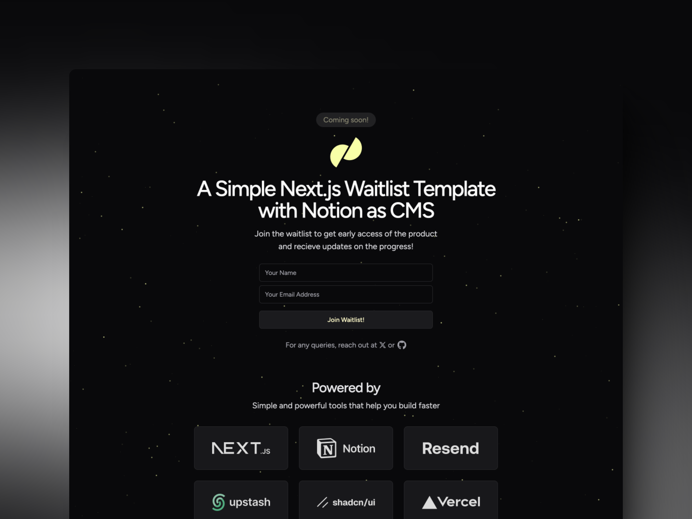

<h1 align="center">Next.js + Notion — Wailtist Template</h1>

<p align="center">


</p>



This is a waitlist application for **Kontentino GPT Apps** using Next.js 14, Notion as a CMS, Upstash Redis for rate limiting and **Postmark** for sending transactional emails.

The UI is built using a mix of shadcn/ui, Magic UI and Tailwind CSS.

**Demo:** [https://nextjs-notion-waitlist.vercel.app](https://nextjs-notion-waitlist.vercel.app)

**Sample Database** ([Link](https://lakshaybhushan.notion.site/15e45b25609e80408f83ebb97b45882b?v=c949c24dff4a42b3baa31bfb3e8a3354))
<a href="https://lakshaybhushan.notion.site/15e45b25609e80408f83ebb97b45882b?v=c949c24dff4a42b3baa31bfb3e8a3354" target="_blank" rel="noopener noreferrer">
 
</a>

## Features

- **Next.js 14**: The most popular React framework
- **Notion as a CMS**: Manage waitlist users in a Notion database
- **Upstash Redis**: Rate limit signups to prevent spam
- **Postmark**: Send transactional emails with high deliverability
- **Railway/Vercel**: Deploy to Railway or Vercel
- **shadcn/ui**: Beautiful UI components built with Radix UI and Tailwind CSS

## Why Notion?

Notion is used everywhere nowadays. It's a great tool for managing content and it's free to use. But a lot of people don't know that they can use Notion as a CMS for their websites which stands for Content Management System. This template is a very basic implementation of using Notion as a CMS for a waitlist.

However, You can extend it to use Notion for other types of content as well. Using Notion as a CMS is a great way to manage content without having to build a backend or a database. You can use Notion's API to fetch data from your Notion workspace and display it on your website.

## How to get started?

There are a few things you need to do before you can use this template:

### Notion

Assuming that you have a Notion account and a workspace, you can create a new database in your workspace and add the following columns:

- **Name**: Title
- **Email**: Email

Now you need to get the `SECRET` key for your workspace. You can create an internal integration and get the secret from the [Notion Integrations page](https://www.notion.so/my-integrations). You will need this key to fetch data from your workspace.

Now you need to get the ID of the database you created. You can get it from the URL of the database. It will look something like this:

`https://www.notion.so/{DATABASE_ID}?v={NUMBERS}`

You need to copy the `DATABASE_ID` from the URL.

### Redis (Rate Limiting)

**For local development**: Use Upstash Redis (free tier, 10K requests/day)
- Sign up at https://console.upstash.com
- Create new Redis database
- Copy REST URL and TOKEN

**For production on Railway**: Use Railway Redis (built-in, no setup needed)
- Add Redis service in Railway dashboard
- `REDIS_URL` automatically configured

The app automatically detects which Redis to use.

**Detailed guide**: See [REDIS_SETUP.md](./REDIS_SETUP.md) for complete instructions.

### Postmark

You need to sign up for a Postmark account (10,000 free emails/month trial). Then verify your sender email address or domain. Generate a Server API token from the Postmark dashboard.

**Detailed guide**: See [POSTMARK_SETUP.md](./POSTMARK_SETUP.md) for step-by-step instructions.

## Building with this template

There are two ways to use this template:

1. **Deploy to Vercel**: Click the button below to deploy this template to Vercel with a single click.

[](https://vercel.com/new/clone?repository-url=https%3A%2F%2Fgithub.com%2Flakshaybhushan%2Fnextjs-notion-waitlist-template&env=NOTION_SECRET,NOTION_DB,RESEND_API_KEY,UPSTASH_REDIS_REST_URL,UPSTASH_REDIS_REST_TOKEN)

The above button will create a new Vercel project and clone this repository into your GitHub account. You will need to provide the following environment variables:

- `NOTION_SECRET`: Your Notion integration secret key
- `NOTION_DB`: The ID of your Notion database
- `POSTMARK_API_KEY`: Your Postmark Server API token
- `POSTMARK_FROM_EMAIL`: Verified sender email address
- `POSTMARK_REPLY_TO`: Email address for replies
- `UPSTASH_REDIS_REST_URL`: Your Upstash Redis REST URL
- `UPSTASH_REDIS_REST_TOKEN`: Your Upstash Redis REST token

2. **Manual Setup**: Fork this repository and clone it to your local machine.

Install the dependencies, this project uses `bun` as a package manager:

```bash
bun install
```

Run the development server:

```bash
bun dev
```

To run the email server:

```bash
bun email
```

Create a `.env.local` file in the root of the project and add the environment variables mentioned above. You can also have a look at the `.env.example` file for reference.

## Deployment Options

### Railway (Recommended for Kontentino)

This project includes Railway configuration for easy deployment.

**See detailed guide**: [RAILWAY_SETUP.md](./RAILWAY_SETUP.md)

**Quick steps**:
1. Push code to GitHub
2. Create new Railway project from GitHub repo
3. Add environment variables in Railway dashboard
4. Railway auto-deploys on every push

### Vercel

Click the "Deploy with Vercel" button above for one-click deployment.

## Documentation

- **[QUICK_START.md](./QUICK_START.md)** - 15-minute quick start guide
- **[NOTION_SETUP.md](./NOTION_SETUP.md)** - Complete guide to setting up Notion database
- **[POSTMARK_SETUP.md](./POSTMARK_SETUP.md)** - Complete guide to setting up Postmark email
- **[REDIS_SETUP.md](./REDIS_SETUP.md)** - Redis setup guide (Railway vs Upstash)
- **[RAILWAY_SETUP.md](./RAILWAY_SETUP.md)** - Guide to deploying on Railway
- **[LOGS_GUIDE.md](./LOGS_GUIDE.md)** - Understanding Railway logs and monitoring

## License

You can use this template for personal or commercial projects. You can modify it as you like.

However, if you use this template for commercial projects, please consider [buying me a coffee](https://www.buymeacoffee.com/lakshaybhushan) or sponsoring me on GitHub. It will help me to keep creating more templates like this.

<a href="https://www.buymeacoffee.com/lakshaybhushan" target="_blank"></a>

---

If you have any questions or need help with this template, feel free to reach out to me on [Twitter](https://x.com/blakssh) or leave a comment on this repository.
